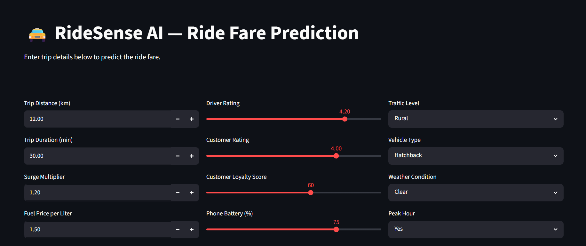
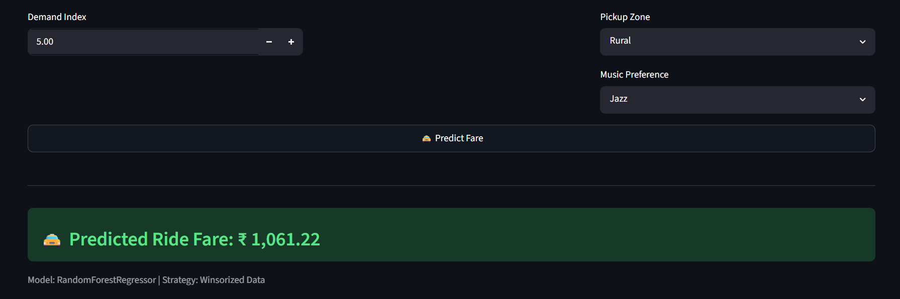
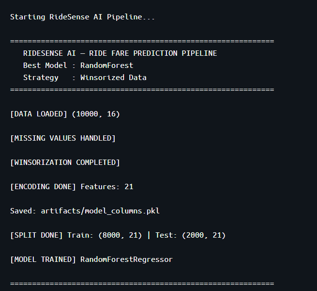
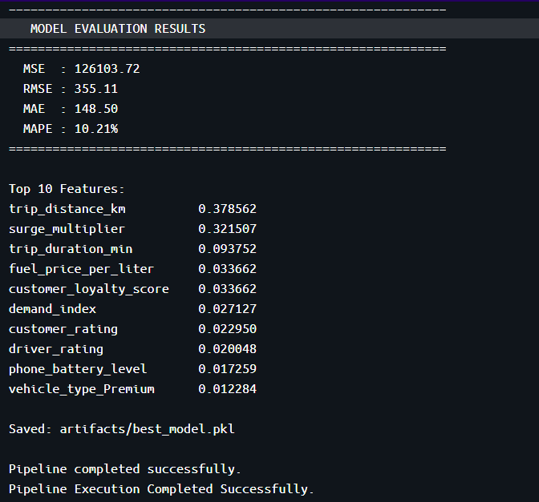

# 🚖 Ride Fare Prediction System


A machine learning regression system that predicts ride fares in real time — helping ride-hailing platforms eliminate pricing inconsistencies caused by traffic, weather, surge pricing, and peak-hour demand.

🚀 **Live Demo:** [Launch Streamlit App](https://ride-fare-prediction-system-qtyvcrjcgemrxrlkpnwj7x.streamlit.app/)

---

## Problem Statement

RideSense AI, a fast-growing ride-hailing platform, faces inconsistencies in fare estimation due to changing traffic conditions, weather, peak-hour demand, and dynamic surge pricing. Incorrect fare predictions lead to customer dissatisfaction, driver complaints, and revenue inefficiencies.

To solve this, a machine learning regression model was built using **10,000 historical ride records** to accurately predict ride fares before trip confirmation — minimizing prediction error and ensuring the model generalizes well under real-world transportation scenarios.

---

## Business Impact

| Problem | Solution |
|---------|----------|
| Inconsistent fare estimates | ML regression model trained on 10K records |
| Customer dissatisfaction | Real-time fare prediction before trip confirmation |
| Revenue inefficiencies | Accurate surge-aware pricing model |
| Manual pricing process | Automated end-to-end prediction pipeline |

---

## Tech Stack

| Category | Tools |
|----------|-------|
| Language | Python |
| Data Processing | Pandas, NumPy |
| ML Models | Random Forest, Decision Tree, KNN, AdaBoost, Linear Regression |
| App Framework | Streamlit |
| Containerization | Docker |
| Model Serialization | Pickle |
| Version Control | Git & GitHub |

---

## ML Pipeline

```
Data Loading → Missing Value Handling → Outlier Treatment (Winsorization)
→ Log Transformation → Feature Encoding (One-Hot) → Train-Test Split
→ Model Experimentation → Feature Selection (Importance-Based)
→ Final Model (Random Forest) → Streamlit Deployment → Docker Containerization
```

---

## Features Used

**Numerical:**

| Feature | Description |
|---------|-------------|
| Trip Distance | Distance of the ride in km |
| Trip Duration | Duration of the ride in minutes |
| Surge Multiplier | Dynamic pricing multiplier |
| Fuel Price | Current fuel price index |
| Demand Index | Real-time demand level |
| Driver Rating | Driver's average rating |
| Customer Rating | Customer's average rating |
| Customer Loyalty Score | Customer loyalty tier score |
| Phone Battery Level | Customer's phone battery at booking |

**Categorical:**

| Feature | Description |
|---------|-------------|
| Traffic Level | Low / Medium / High |
| Vehicle Type | Economy / Premium / SUV etc. |
| Weather Condition | Clear / Rainy / Foggy etc. |
| Peak Hour | Whether booking is during peak hours |
| Pickup Zone | Zone of pickup location |
| Music Preference | In-ride music preference |

---

## Model Experimentation

Five regression algorithms were evaluated before selecting the final model:

| Model | Notes |
|-------|-------|
| Linear Regression | Baseline model |
| KNeighbors Regressor | Distance-based approach |
| Decision Tree Regressor | Non-linear splits |
| AdaBoost Regressor | Boosting ensemble |
| **Random Forest Regressor** | ✅ Selected — best performance |

**Final Strategy:** Winsorized dataset + Random Forest Regressor

---

## Model Evaluation Metrics

- **MAE** — Mean Absolute Error
- **RMSE** — Root Mean Squared Error
- **MAPE** — Mean Absolute Percentage Error
- **MSE** — Mean Squared Error

---

## Model Highlights

- End-to-end regression pipeline on 10,000 ride records
- Outlier handling using **Winsorization (IQR method)**
- **Feature importance-based selection** using Random Forest
- Multiple model experimentation with metric comparison
- Real-time fare prediction via Streamlit
- Docker containerization for reproducibility
- Logging integration for pipeline tracking
- Model serialization using Pickle

---

## Project Structure

```
RideSense_AI/
│
├── artifacts/
│   ├── best_model.pkl          # Trained Random Forest model
│   ├── model_columns.pkl       # Encoded feature columns
│   └── ridesense_dataset.csv   # Historical ride dataset
│
├── images/                     # Screenshots and visuals
│
├── logs/
│   ├── ridesense.log                   # Pipeline logs
│   └── ridesense_experimentation.log   # Experimentation logs
│
├── app.py                      # Streamlit application
├── pipeline.py                 # Training pipeline
├── experimentation.py          # Model experimentation
├── Dockerfile
├── requirements.txt
├── README.md
└── .gitignore
```

---

## Getting Started

### 1. Install Requirements

```bash
pip install -r requirements.txt
```

### 2. Run Training Pipeline

```bash
python pipeline.py
```

This generates:
- Trained Random Forest model (`best_model.pkl`)
- Encoded feature columns (`model_columns.pkl`)

### 3. Launch Streamlit App

```bash
streamlit run app.py
```

---

## Docker Support

### Build Image

```bash
docker build -t ridesense-app .
```

### Run Container

```bash
docker run ridesense-app
```

---

## Application Screenshots

### Streamlit Homepage


### Fare Prediction Result


### Docker Deployment



---

## Future Improvements

- [ ] Hyperparameter tuning (GridSearchCV / Optuna)
- [ ] CI/CD pipeline integration
- [ ] Cloud deployment (AWS / Azure)
- [ ] Real-time API integration
- [ ] Advanced feature engineering
- [ ] Explainable AI (SHAP values)

---

## Author

**Raj Kiran Reddy**  
B.Tech Data Science | MLRITM
📍 Hyderabad, India

[](https://github.com/)
[](https://linkedin.com/)